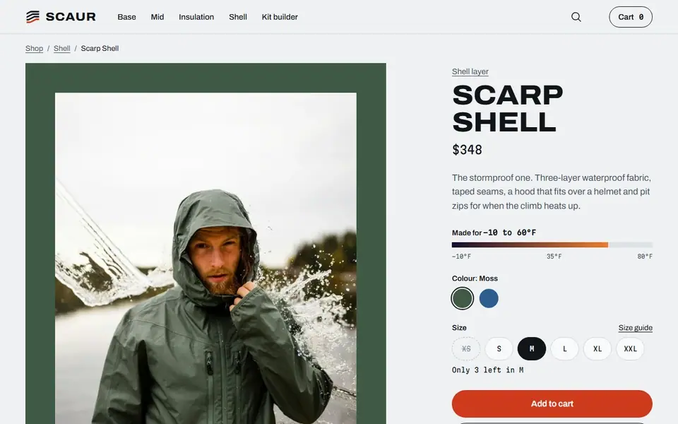
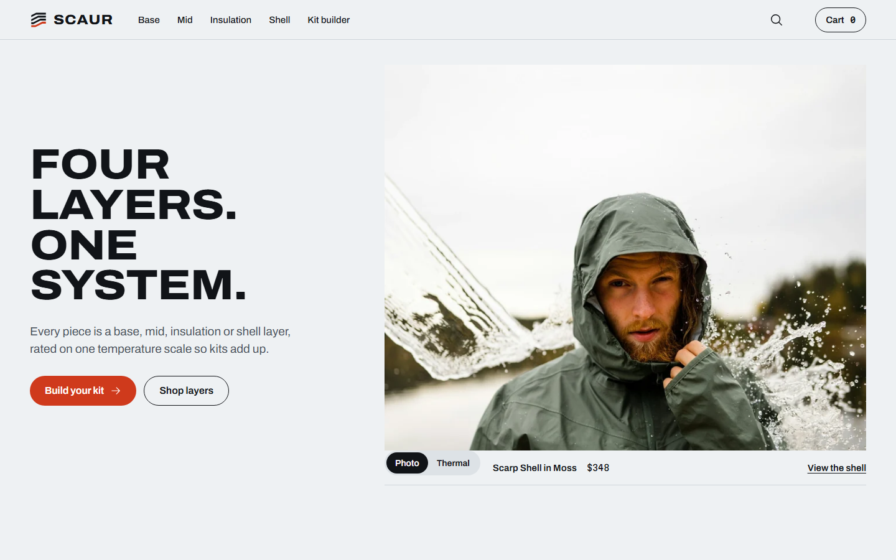
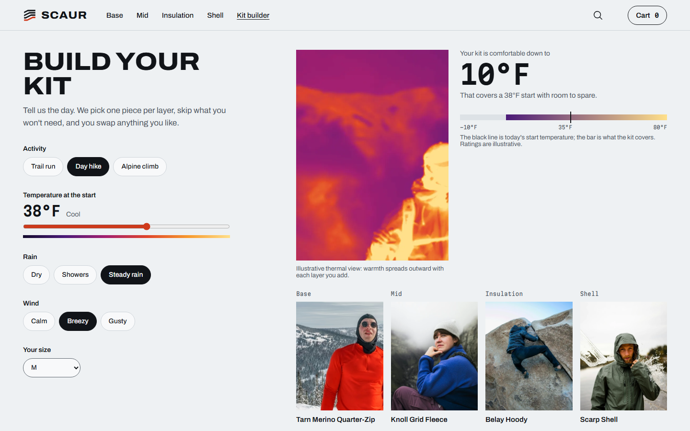
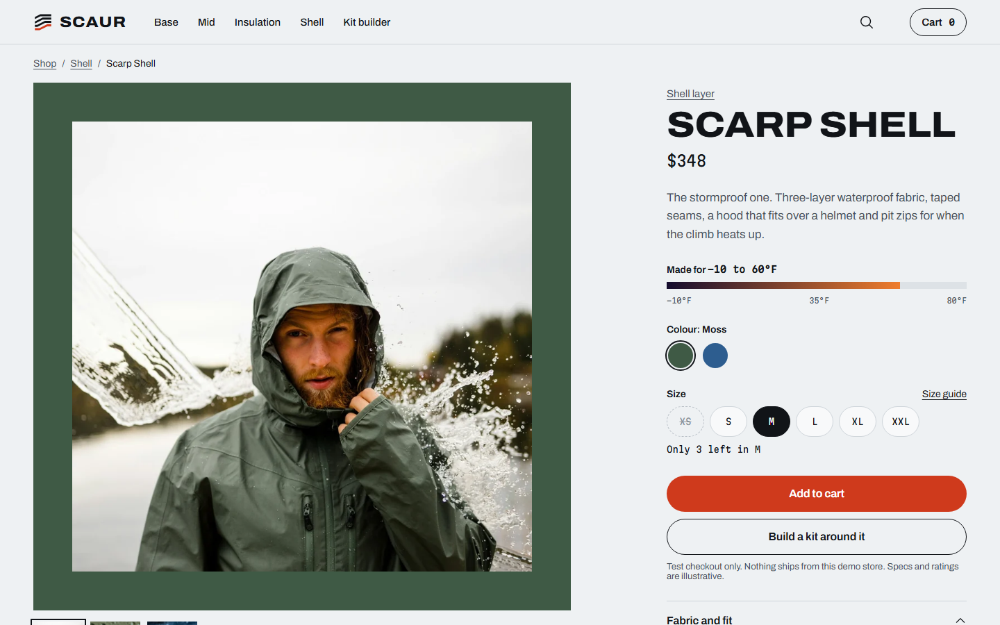

# Scaur

A headless Shopify store for a fictional outdoor brand. Every product is a base, mid, insulation or shell layer rated on one temperature scale, and a kit builder turns the day's activity and weather into a full layering system you add to the cart in one action.

Built with Next.js 16 on Shopify's Storefront API and a real development store: live stock, real carts and Shopify's own checkout in test mode.

**Live:** [scaur.vercel.app](https://scaur.vercel.app) &nbsp;·&nbsp; **Design match report:** [/fidelity/report.html](https://scaur.vercel.app/fidelity/report.html) &nbsp;·&nbsp; **How it was built:** [/about](https://scaur.vercel.app/about)

> Scaur is fictional and made for a portfolio. Nothing is for sale, checkout runs in test mode, and the site is kept out of search engines.



| Home | Kit builder | Product |
|---|---|---|
|  |  |  |

## What it does

- **Kit builder.** Pick the activity, temperature, rain and wind; the rules pick one piece per layer in your size, skip what the day doesn't need, and show how cold the kit is comfortable down to. Swap or remove any piece, then add the whole kit in one click. The kit stays grouped in the cart with an "Edit kit" link back to it.
- **Thermal view.** Every product photo flips to an illustrative thermal image, and every piece shows its range on the same -10°F to 80°F axis.
- **Live stock.** Sold-out sizes stay visible but can't be chosen, "Only 3 left in M" comes from real inventory, and the cart's plus button stops at what Shopify has. The server checks stock again before every cart change.
- **Filters in the URL.** Layer, temperature and Photo/Thermal live in the address, so a shared link opens the same view.
- **Predictive search** by name, layer or temperature ("20°F"), fully keyboard operable.
- **Designed states** for loading, sold out, empty results, a failed cart change and the store not responding.
- **Works without JavaScript** where it matters: the kit builder is a real form that submits to its own URL.

## Stack

| | |
|---|---|
| Framework | Next.js 16 (App Router, Server Components, Server Actions), React 19 with the React Compiler, TypeScript strict |
| Commerce | Shopify Storefront API 2026-07 through one typed `fetch` wrapper; no Shopify SDK. The private token stays on the server. |
| State | URL search params for anything shareable; Zustand only for the cart drawer |
| Styling | Tailwind CSS v4 with the design's colours, type and spacing as tokens; Phosphor icons |
| Tests | Vitest (kit rules, catalogue parser, URL and format helpers) and Playwright with axe on every page |
| Hosting | Vercel Hobby. Running cost: $0 a month. |

Five runtime dependencies: `next`, `react`, `react-dom`, `zustand` and `@phosphor-icons/react`.

## How the catalogue is modelled in Shopify

| Concept | Where it lives |
|---|---|
| Layer | Product type: `Base`, `Mid`, `Insulation`, `Shell` |
| Temperature range, warmth, shell role | Tags: `temp-lo:25`, `temp-hi:60`, `warmth:2`, `shell-role:storm` |
| Colour and size | Product options, in that order; each colour's variant image is its photo |
| Fabric and fit, Features, Care | Metafields `custom.fabric_fit`, `custom.features`, `custom.care` |
| A kit in the cart | Line attributes `_kitId`, `_kit` and `_kitUrl` (hidden at checkout) |

`src/lib/catalog.ts` turns raw products into typed ones; a product with missing or malformed tags is left out of the scale and the kit rather than breaking a page.

## The kit rules, in brief

`src/lib/kit.ts` is a pure function, unit tested on all 2,187 input combinations against the design's own reference implementation.

1. **Feels-like:** temperature + activity output (run +12, hike 0, alpine -10) - wind (breezy 6, gusty 14) - 6 for steady rain.
2. **Layers needed:** base always; mid below 58°F; insulation below 30°F; a shell in rain, in gusty wind or below 20°F.
3. **Picks:** each layer chooses a piece by how cold it feels (for example Bothy Pile below 22°F, Knoll Grid Fleece below 42°F); shells are chosen by role (storm, rain, showers, wind) from tags, so renaming a product doesn't break the rules.
4. **Comfortable down to:** 70 - 6 × the kit's total warmth - activity output.
5. **Stock:** if the pick has nothing in your size, the next piece in that layer that does takes its place.

Default kit (day hike, 38°F, steady rain, breezy, size M): Tarn Merino Quarter-Zip, Knoll Grid Fleece, Belay Hoody and Scarp Shell, $782, comfortable down to 10°F.

## Numbers

Measured on the production build. Nothing here is estimated.

| Check | Result |
|---|---|
| Unit tests (Vitest) | 57 passing, including the kit rules on all 2,187 inputs |
| End-to-end tests (Playwright, desktop and phone) | 67 passing, with axe on every page: 0 violations |
| Horizontal overflow | None on 40 screenshots from 320 to 1920px |
| Layout shift (CLS) | 0 on home, shop, product and kit |
| Initial JavaScript | 141 to 151 KB gzip per page, of which about 130 KB is React and the Next.js runtime |
| Lighthouse (mobile) | Measured on the live site with PageSpeed Insights after deploy |
| Running cost | $0 a month |

The initial JavaScript misses the brief's 120 KB target: the framework alone is above it on Next.js 16, and Scaur's own code is about 20 KB.

## Design fidelity

Every page was designed first at 1440, 768 and 390px wide. The build is screenshotted at the same widths and compared with the design pixel by pixel (1px-tolerant match). The full report shows each page side by side with the differences marked.

Measured 1 Oct 2026 against the production build:

| Page | 1440 | 768 | 390 |
|---|---|---|---|
| Home | 89.9% | 88.3% | 79.9% |
| Shop | 99.4% | 97.8% | 96.8% |
| Product | 97.1% | 94.6% | 95.3% |
| Kit builder | 96.1% | 85.4% | 95.9% |
| How this store was built | 99.2% | | 90.7% |
| Credits | 98.1% | | |
| 404 | 98.4% | | |

Where the rest differs: the design pictures a two-item cart in the header (the build shows the visitor's real cart), stock lines read live inventory, products within a layer are ordered by temperature rather than the artboard's hand order, and "Finish the kit" uses the kit rules' own picks.

## Run it against your own development store

1. Create a free development store from [Shopify Partners](https://partners.shopify.com) (US, USD).
2. Import `content/shopify-products.csv` (Products, Import). The product copy for the accordions is in `content/product-details.json`; add it as the three `custom.*` metafields above, or the accordions stay hidden.
3. Install the **Headless** sales channel, give it product, inventory and cart access, publish the products to it and copy the private token.
4. Activate the **Bogus Gateway** for test payments and add a flat shipping rate.
5. Create `.env.local`:

   ```
   SHOPIFY_STORE_DOMAIN=your-store.myshopify.com
   SHOPIFY_STOREFRONT_PRIVATE_TOKEN=...
   SHOPIFY_STOREFRONT_API_VERSION=2026-07
   NEXT_PUBLIC_SITE_URL=http://localhost:3000
   NEXT_PUBLIC_STORE_PASSWORD=your store password
   ```

6. Install and run:

   ```bash
   npm install
   npm run shopify:check   # checks the store returns the 11 products and the default kit
   npm run dev
   ```

Other scripts: `npm test` (unit), `npm run test:e2e` (builds, then runs Playwright), `npm run typecheck`, `npm run lint`.

## Docs

- [`docs/PRD.md`](docs/PRD.md): goals, features and acceptance criteria
- [`docs/ARCHITECTURE.md`](docs/ARCHITECTURE.md): data layer, kit rules, cart, caching and tests
- [`DESIGN.md`](DESIGN.md): the design system as built
- [`docs/DESIGN-SPEC.md`](docs/DESIGN-SPEC.md): the design handoff

## Credits

Photography from Unsplash under the Unsplash License, with photographers and edits listed in [`ATTRIBUTION.md`](ATTRIBUTION.md) and on the site's credits page. Archivo and Martian Mono under the SIL Open Font License; Phosphor Icons under MIT.

Design and build by Daniel Omoyibo.
